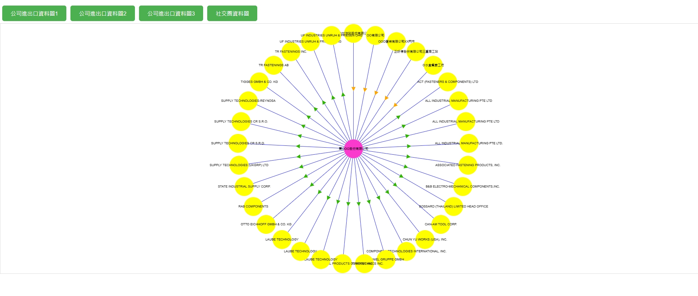
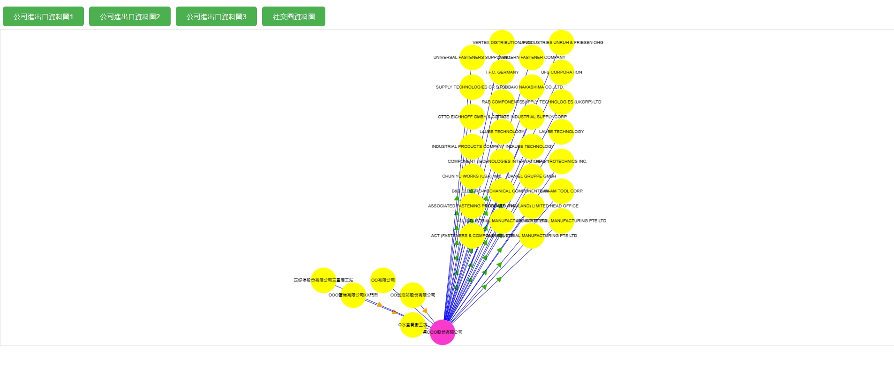
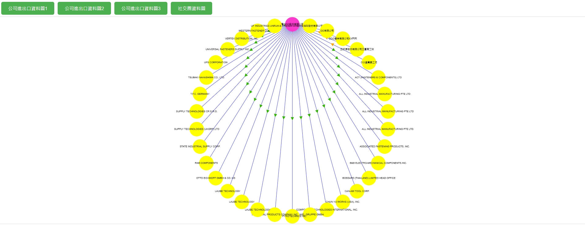
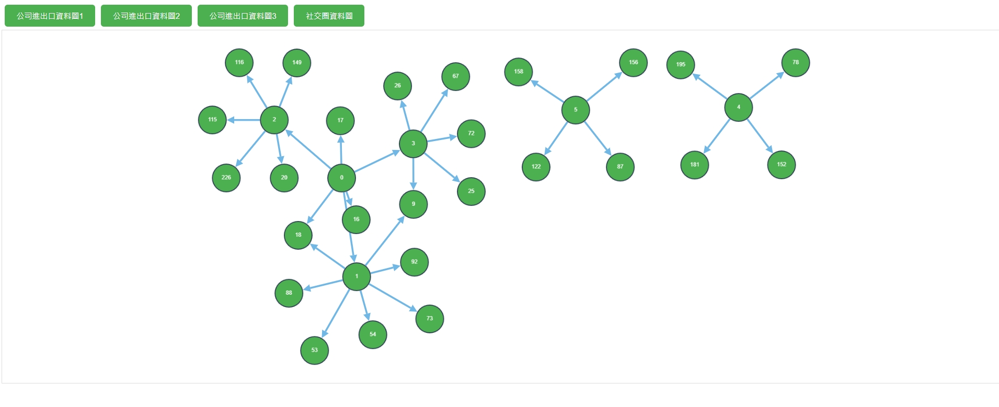

# 數據分析圖形模組
當需要將原始數據轉為可視化圖表時，本網站提供數據轉換為各類圖表的範例功能，解決了原始數據難以直觀呈現的問題。透過此功能，用戶能將複雜的數據轉換為易於理解的圖形，達到提升數據分析效率與視覺化呈現效果的目的。

### 所用技術
1.Node.js  
2.Vue3  
3.Cytoscape.js  
4.Java Script  
5.Java 17  
6.Spring Boot  
7.Restful API  
8.Maven  

### 安裝指南及操作
1.安裝 Node.js，版本至少16.15.1  
2.安裝 Java 17  
3.下載 git clone https://gitlab.iisigroup.com/ps150/g-p231301/modapc/dataanalysisgraph.git  
4.cd cytoscape  
5.打包專案，會自動將前端打包好放進後端 mvn install  
6.啟動 mvn spring-boot:run  
7.打開瀏覽器輸入 http://localhost:8080/ 操作  

### 使用情境範例
一. 公司進出口資料  
本範例為分析該營業人進出口情形，將數據套用數據分析圖形模組，讓數據更加值觀，方便使用者觀察或分析，此處有三種圖形展示。

* 結果展示  
  圖1:  
    
  此為同心圓(concentric)圖，圓心為營業業人，為所有有圓點的中心，箭頭朝外代表營業人出口對象，箭頭朝著圓心代表營業人進口對象  

  圖2:  
    
  此為預設圖，可指定每一個圓點的位置。本圖指定每一個圓點位置，以四象限圖呈現營業人進出口情形

  圖3:  
    
  此為圓圈(circle)圖，圓圈上方的圓為中心，延伸出其他圓點，箭頭朝外代表營業人出口對象，箭頭朝著圓心代表營業人進口對象  

二. 社交朋友圈資料  
本範例為分析社交朋友圈的交友關係，藉由此圖形可以快速了解自己或朋友之間的關係。

* 結果展示  
    
此為cose圖，圖中可以清楚的顯示0號與1號是朋友關係，且他們還有一位共同好友18號，以此類推可以清楚顯示朋友圈之間的關係。  

### License
本專案採用 CC0 1.0 Universal (CC0 1.0) 公共領域貢獻 授權條款。詳細授權內容請參閱 LICENSE 文件。
